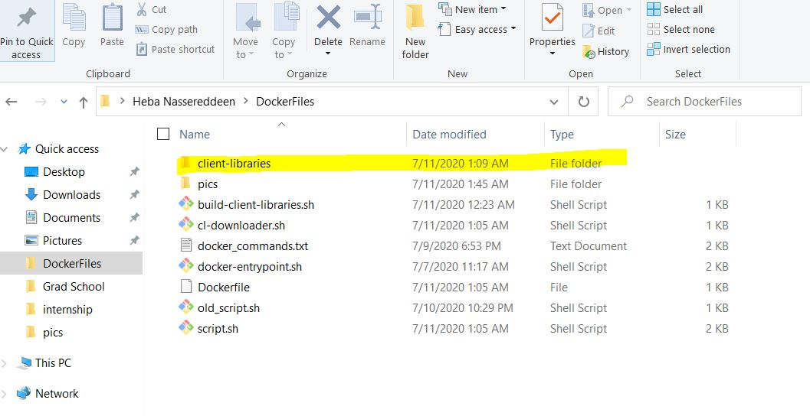

# Engineerica Client Libraries Generator

This document describes how to use the _thehebster/engineerica-cl-generator_ Docker image to automatically generate Engineerica&#39;s client libraries. After reading this guide, you will gain knowledge on how to 1) run the published Docker image, 2) transfer files from the Docker container to your local machine, and 3) make changes to the DockerFile.

1. **Required Software**

    [Docker](https://docs.docker.com/get-docker/)

2. **Running the existing Docker image**

    The Engineerica client libraries generator is publicly available on Docker Hub&#39;s remote registry. To run the published image, open a terminal window (we will be using the Docker QuickStart shell) and enter the following command:
    
    `docker run -v host_path:container_path thehebster/engineerica-cl-generator:1.0`
    Example: `docker run -v "${PWD}:/client-libraries" thehebster/engineerica-cl-generator:1.0`

     
    The generation of the client libraries will begin automatically; give the process about 10 minutes to complete. After the client libraries have been generated, the client-libraries folder will be downloaded to the specified host directory and the container will exit. 
    
    If you see the client-libraries folder on your host machine, congratulations, you are finished! If you are having trouble using the -v argument to establish a mount point on your host machine, enter the following command and continue on to step 3 to manually download the client-libraries folder:

    `docker run thehebster/engineerica-cl-generator:1.0`

    It will be useful to have the container ID ready for the next step. Enter the command below to obtain the container ID:
    
    `docker ps -a`
    
    

3. **Downloading the client-libraries folder (optional)**

    The Docker image creates a client-libraries folder in the root directory of the container. To copy the files from the container to your machine, navigate to the *cl-downloader* script on your machine and restart the container:
    
    `docker start [container_id];`
    
    After the container has been restarted, run the *cl-downloader* script to download the client-libraries folder from the container to your local machine.
    
    `bash cl-downloader.sh`
    
    You will be prompted to enter the container ID and a path on your local machine to save the client libraries to. The path can be specified as a relative path or as an absolute path.

    
    
    After the script terminates, you will find the client-libraries folder in the specified directory.
    
    
    
    Alternatively, instead of running the *cl-downloader* script, you can manually enter the docker cp command like this:
    
    `docker cp [container_id*]:[path_to_file_in_container] [path_in_local_machine]`
    
    **Example** : `docker cp d485461282f9:/client-libraries Users/heba_/DockerFiles`

    \* Note: _The container ID can be substituted with the container name_

   **4. Creating an image from the DockerFile**

   If the DockerFile is updated or changed, you can rebuild the image with the following command (assuming you are in the same directory as the DockerFile):

   `docker build -t [image_name:tag] .`

   After the image has been built, you can run the image with the following command:

   `docker run [image_name:tag]`
    
